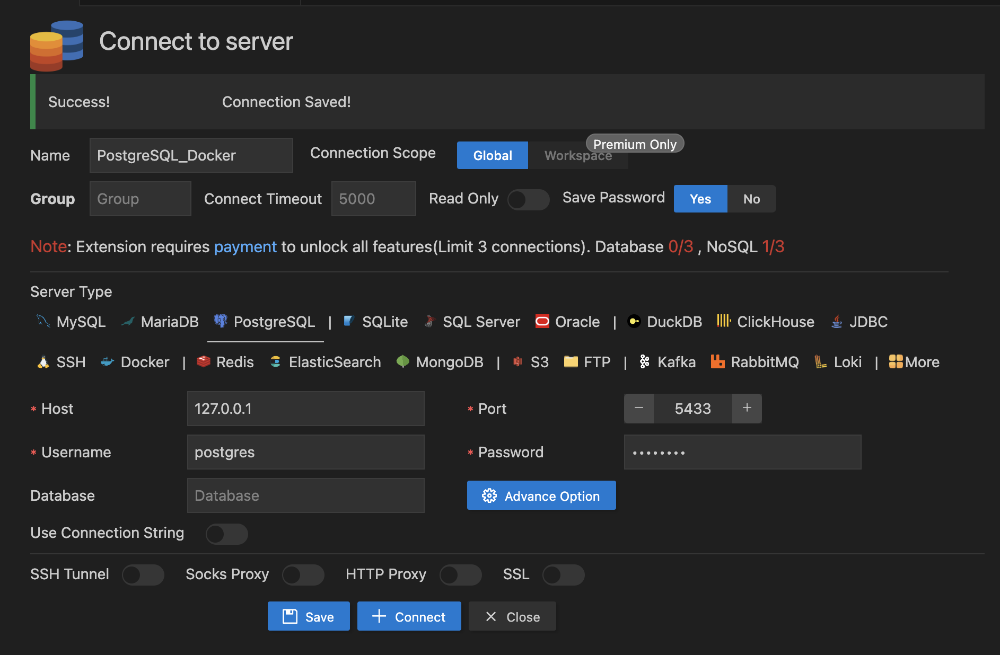
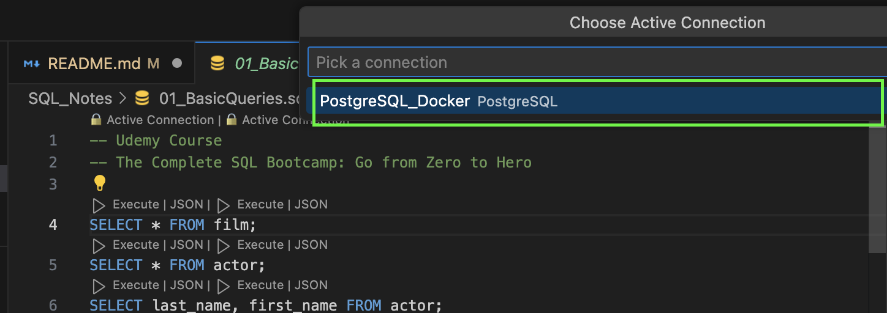
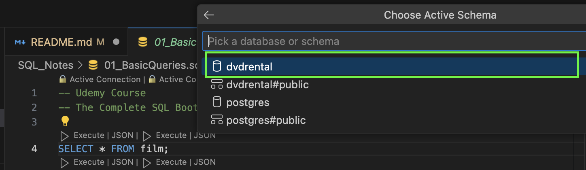
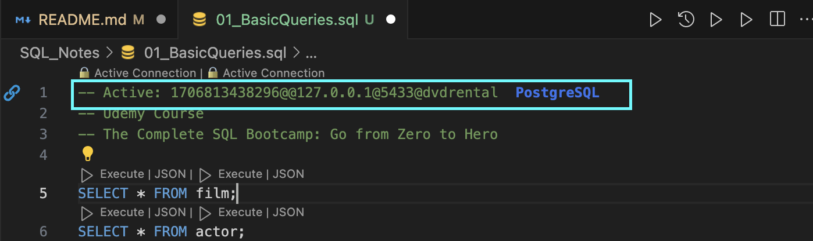

# SQL BootCamp From Zero to Hero
SQL Notes. Each of the files has the following content, with their respective notes and command examples. 

## 01_BasicQueries.sql
- SELECT 
- COUNT 
- DISTINCT 
- ORDER BY 
- BETWEEN 
- IN 
- LIKE 
- Aggregation Functions 
- GROUP BY
- HAVING 

## 02_Joins.sql
- AS
- INNER JOINS
- OUTER JOIN
- LEFT OUTER JOINS
- RIGHT OUTER JOINS
- UNIONS

## 03_AdvancedCommands.sql
- TIMESTAMPS
- EXTRACT
- AGE
- TO_CHAR
- String Functions
- SubQuery
- Self Join

## 04_CreatingDataBasesAndTables.sql
- Data Types
- CREATE DATABASE
- CREATE TABLE
- PRIMARY KEYS
- FOREIGN KEYS
- CONSTRAINTS (CHECK, NOT NULL, UNIQUE, REFERENCES, SERIAL)
- INSERT
- UPDATE
- DELETE
- ALTER 
- DROP

## 05_ConditionalExpressionsAndProcedures.sql
- CASE
- COALESCE
- NULLIF
- VIEWS
- Imports and Exports

## SQL_COMPLETE_COURSE.sql
All of the mentioned topics above in the order they were presented during the course. 

## Instructions

__Using Docker__ 
1. Download this repository
2. Run Docker
3. In the Terminal run the following command
```
docker-compose up --detach --wait
```

4. Stablish the DataBase Connection. Using the DataBase for VSCode Extension. 

    
    - Name: You can rename it as you please
    - Host: 127.0.0.1
    - Port: 5433 (This is due to the docker-compose.yaml configuration)
    - Username: postgres
    - Password: password

        **Remember to Select PostgreSQL**


5. Select one of the SQL files and stablish the connection.
    - Select the DataBase Connection
    - Select the target DataBase
    - The used file will automatically generate the command indicating the connection.




6. Once you have finished. Run the following command in order to stop de container
```
docker-compose stop
```

In case you want to remove the container, you can run next:
```
docker-compose down
```


**Recomendation**

You can install PostgreSQL and PgAdmin in order to make it easir working with DataBases. 